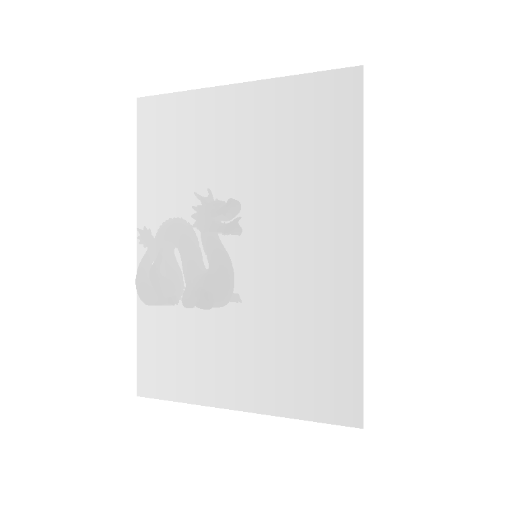
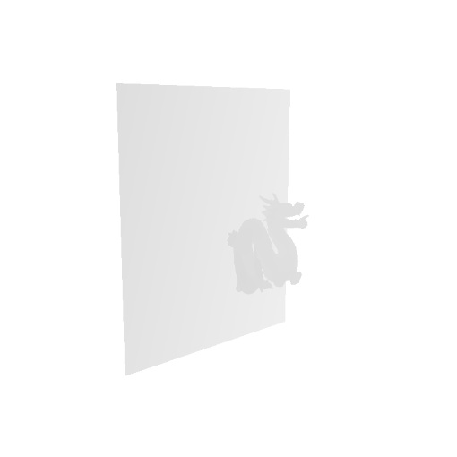
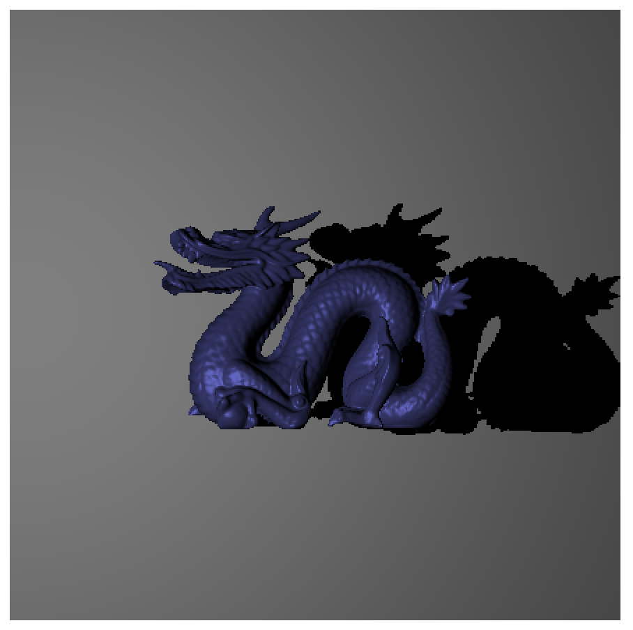
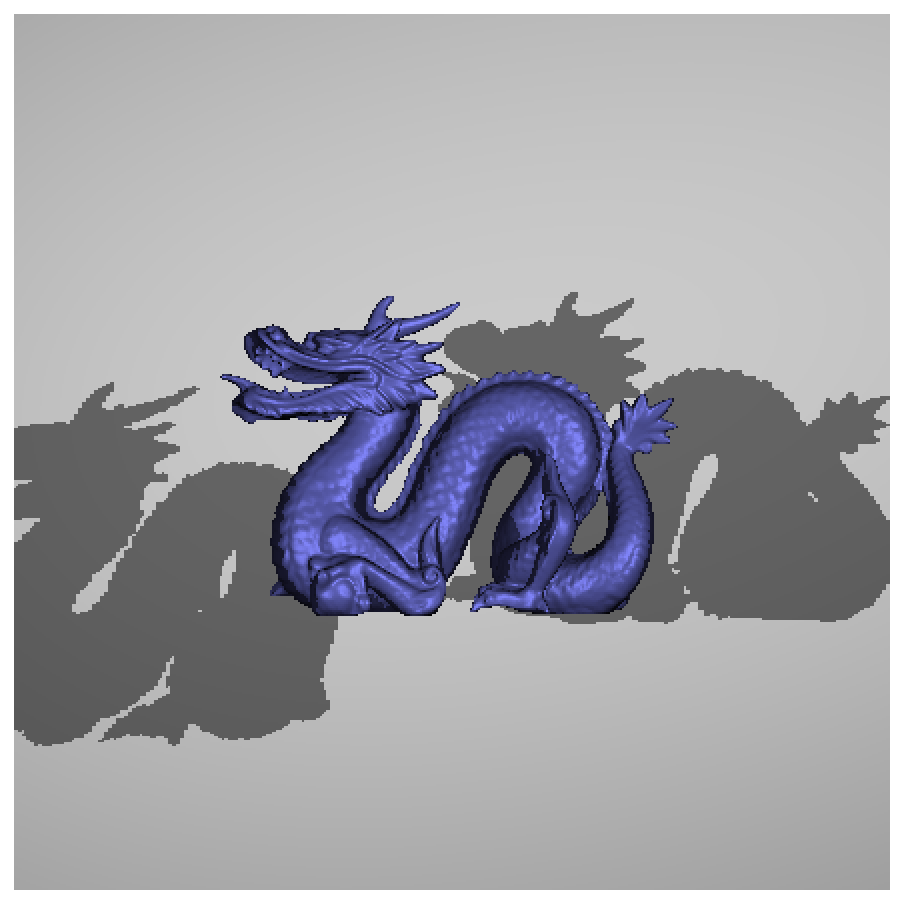
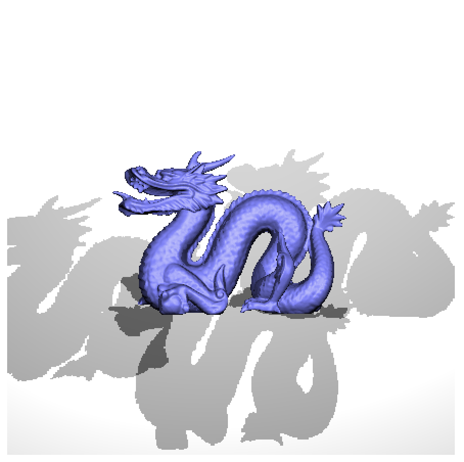

# Shadow maps

## Shadow map (light 1)

## Shadow map (light 2)

## Shadow map (light 3)

## Rendering with 1 light

## Rendering with 2 lights

## Rendering with 2 lights after few seconds of animation

## Rendering with 3 lights
