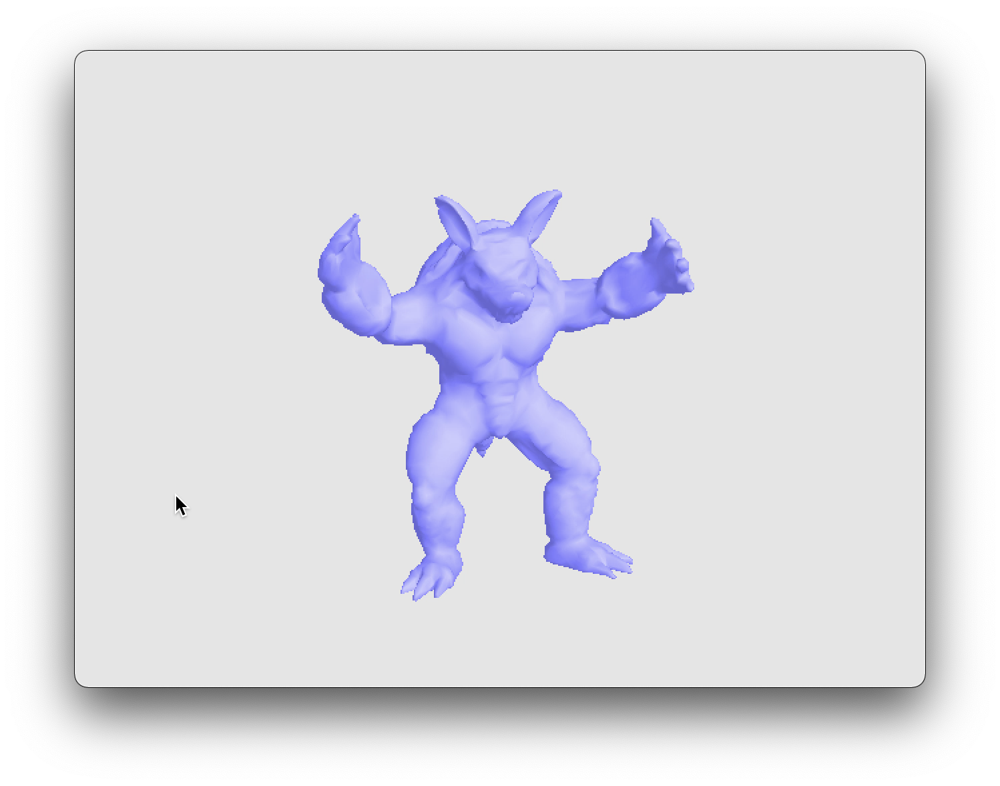
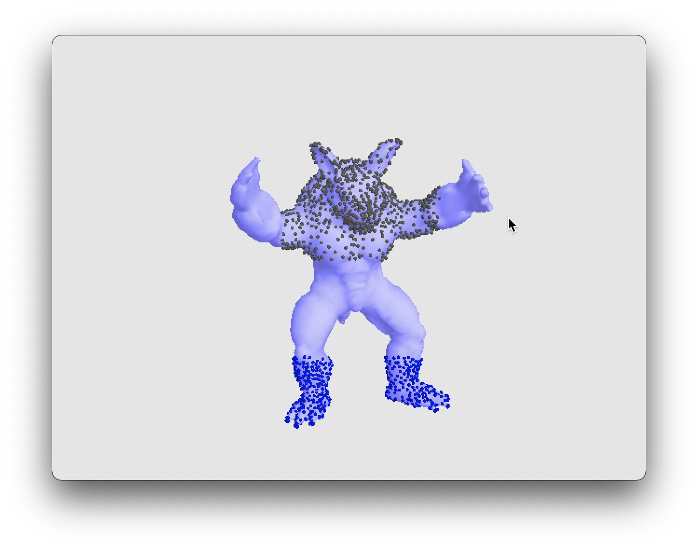
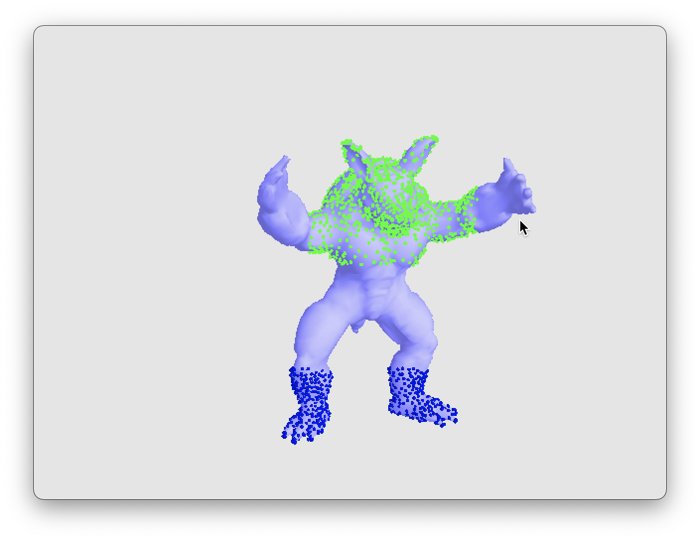
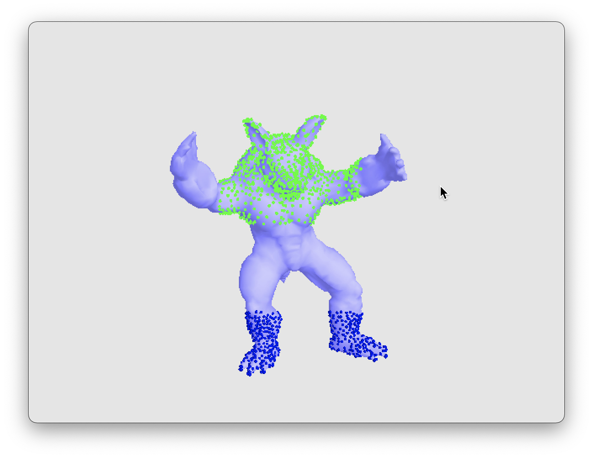
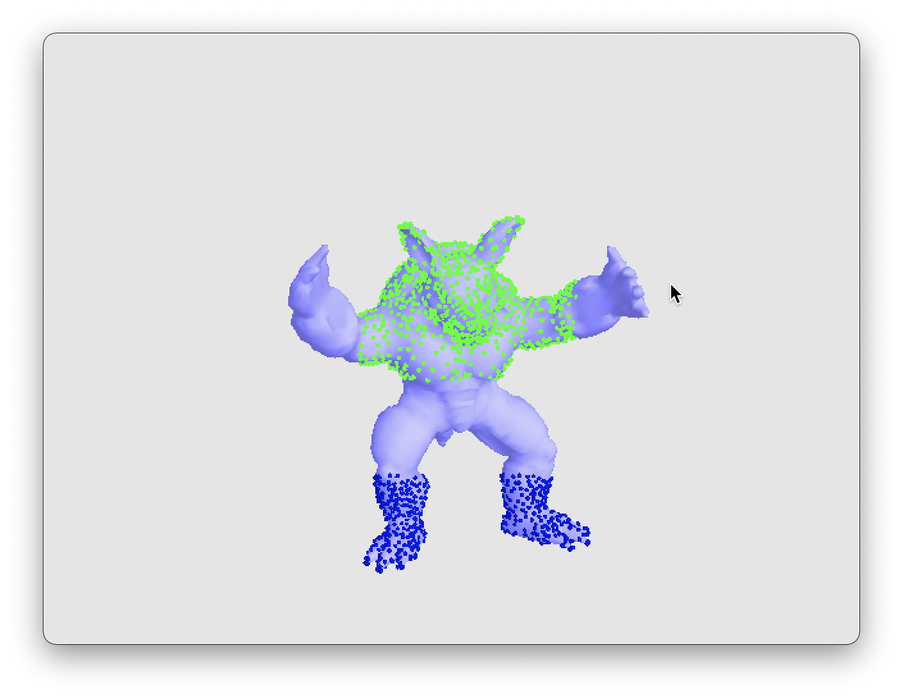
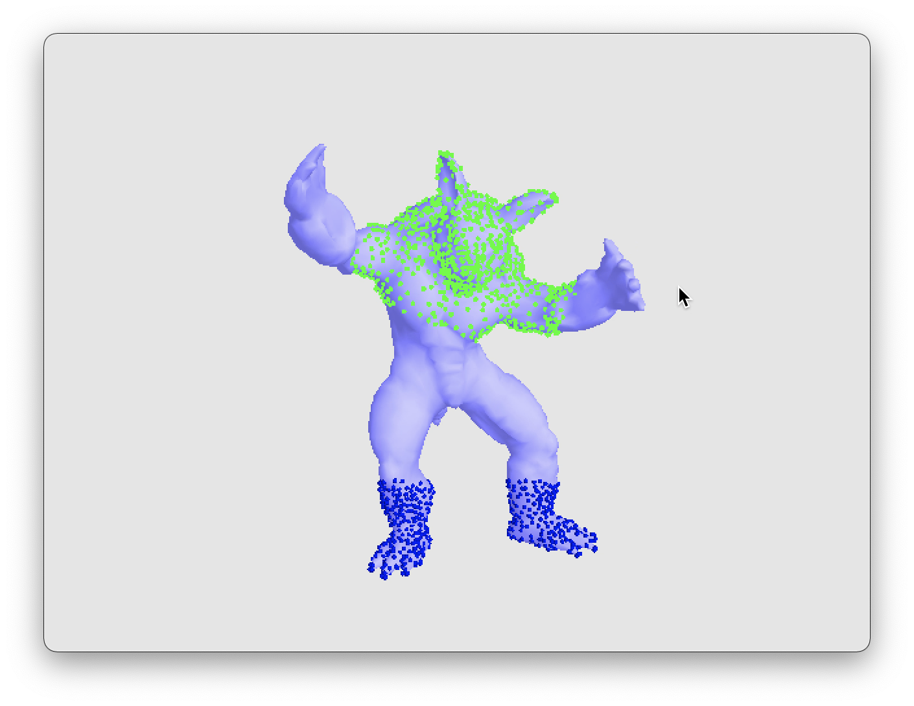
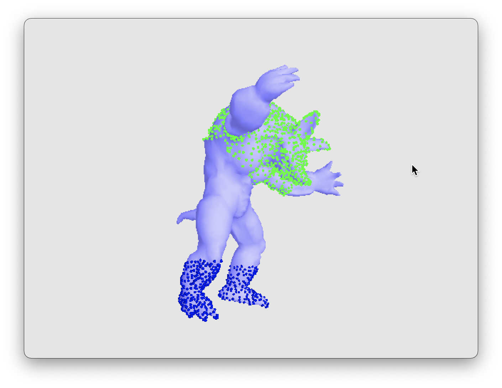

# As-Rigid-As-Possible animation

```
Still work in progress
```
[Click to watch a demo !](https://youtu.be/4ekbBKWVHhY)

## Base mesh


## Selecting vertices to remain static


## Vertices translation through deformation




## Vertices rotation through deformation

